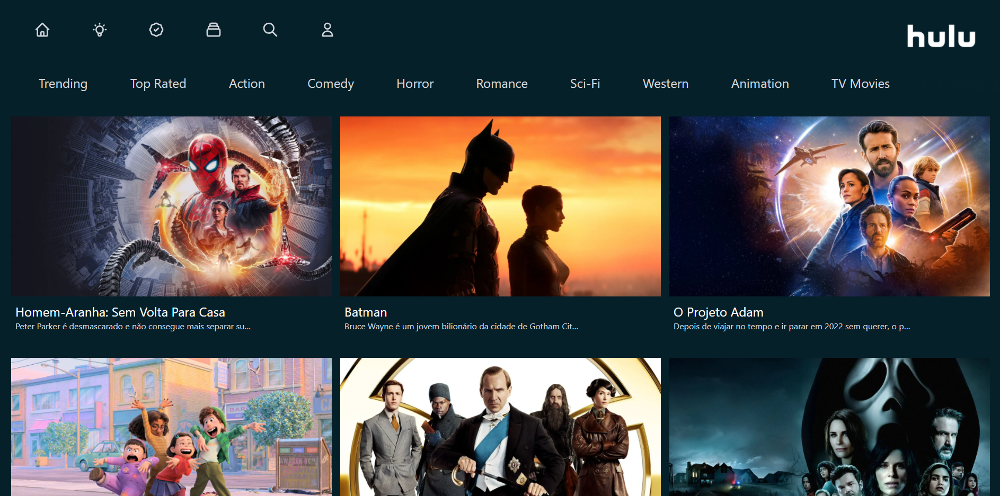

### 🚩 O desafio

Criar aplicaçao Filmes com o The Movie DataBase.

## 🛠 Tecnologias utilizadas

-   ⚛️ **React** — Single page application
-   ⚛️ **NextJs** - ServerSideRender
-   ⚛️ **React-Loading** - Carregamento para espera de filmes
-   💅 **Tailwind** — Estilização dos componente
-   💅 **Heroicons** — Icones estilizados

## 🚀 Rodando o projeto

### Pré-requisitos

-   Git
-   NodeJS
-   Yarn

### 🖥 Rodando a aplicação

Clone o repositório

# Instala as dependências

npm install

# Inicia a aplicação

yarn start

# Imagem da tela inicial da Aplicacao

